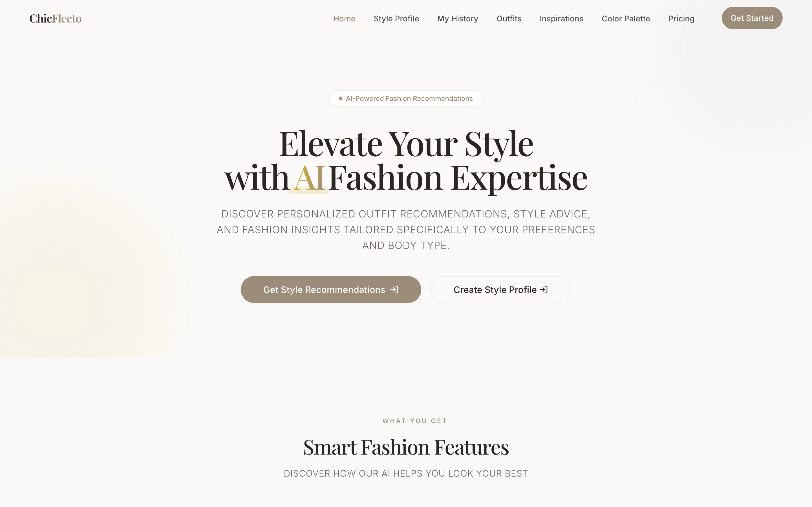
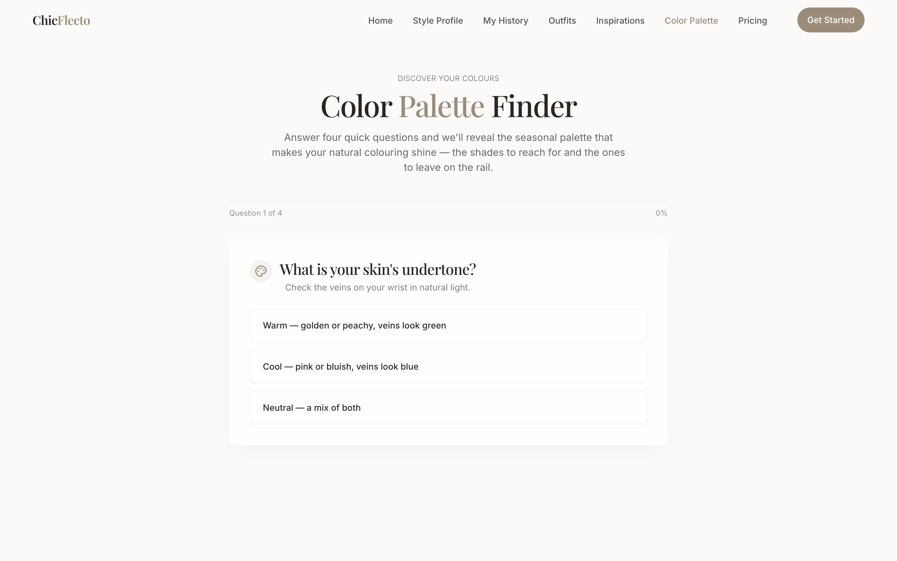
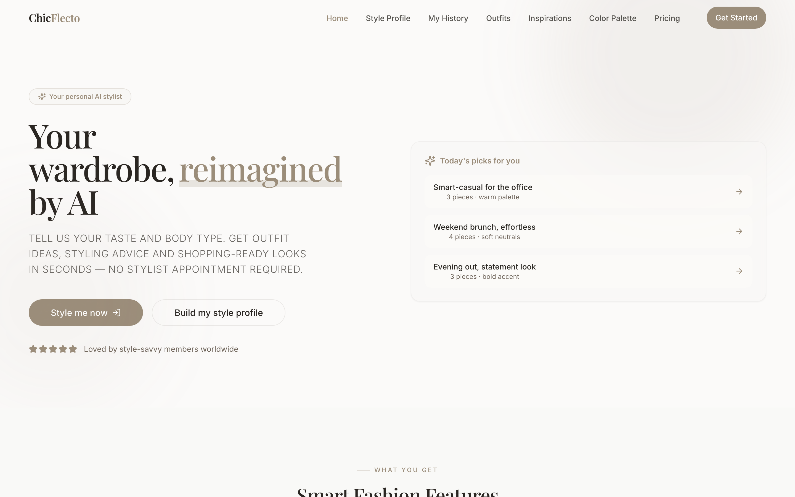
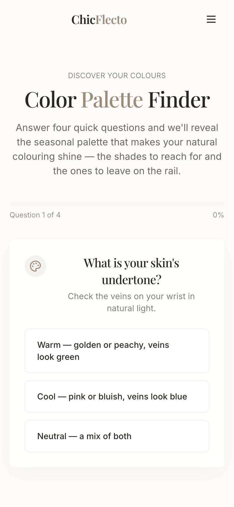

# ChicFlecto — Your AI Fashion Stylist 👗✨

<p align="center">
  <a href="https://fashion.techrealm.ai"></a>
  
  
  
  
  
  
  
  
</p>

> Snap a photo, spill your vibe, and let ChicFlecto do the *outfit math*. It's a personal
> stylist that lives in your browser — no appointment, no judgment, just tailored looks,
> color advice, and wardrobe wisdom on demand.

ChicFlecto is a modern, single-page fashion app that turns your uploaded photo into
personalized style advice. Upload a look, and the app talks to a vision-powered styling
API to hand you back a deck of bite-sized style cards — think of it as a stylist who
leaves you sticky notes instead of a bill.

<p align="center">
  
</p>

<p align="center">
  <a href="https://fashion.techrealm.ai"><strong>🌐 Try the live app → fashion.techrealm.ai</strong></a>
</p>

### ⚡ Quick start

```bash
git clone https://github.com/waleedsworld/chicflecto-stylist-ai.git && cd chicflecto-stylist-ai && npm install && npm run dev
```

Then open the URL Vite prints (usually `http://localhost:8080`). Full step-by-step below.

---

## 🆕 What's new in this release

This drop is a big glow-up — new features, a polished coat of paint, and the plumbing to keep it honest:

- **🎨 Color Palette Finder** — a brand-new, fully client-side seasonal color quiz. Answer four quick questions about your natural coloring and ChicFlecto reveals your *season* (Spring / Summer / Autumn / Winter), the shades that make you glow, and the ones to leave on the rail. No login, no network — just instant, shareable color science. *(Public page: `/color-palette`.)*
- **🕰️ My Style History** — every outfit analysis you run is now saved so you can revisit past looks, compare advice over time, and never lose that one recommendation you loved. *(`/style-history`.)*
- **💅 Elevated UI** — a richer landing page with reveal-on-hover outfit cards, a gradient scrim for legible captions, animated micro-interactions, blur-up image loading, and refined typography.
- **♿ Accessibility & performance** — skip-to-content link, a single clean landmark structure, `aria-current` nav states, visible focus rings, `prefers-reduced-motion` support, and vendor code-splitting so first paint stays feather-light.
- **📱 Rock-solid mobile nav** — tap-outside-to-close backdrop, Escape-to-dismiss, scroll-locking, 44px tap targets, and zero horizontal overflow from phone to widescreen.
- **🔬 A/B hero variant** — a second landing hero hides behind `?variant=b` so you can test which pitch converts. *(See [`docs/ab-landing-variants.md`](docs/ab-landing-variants.md).)*
- **🔎 Discoverability & PWA** — full Open Graph + Twitter cards, Schema.org JSON-LD, `sitemap.xml`, `robots.txt`, an installable web manifest with a real icon set.
- **🧪 Real test coverage** — a Vitest unit suite + a Playwright smoke test, wired into GitHub Actions CI.

---

## ✨ Core features

- **AI Style Analysis** — upload a photo and get a swipeable deck of style cards tailored to the outfit.
- **Curated Outfit Inspirations** — a filterable showcase (Casual, Formal, Business, Athletic, Evening) to spark ideas.
- **Style Profile** — save your preferences so recommendations actually feel like *you*.
- **Color Coordination & Wardrobe tips** — palettes that flatter, plus ways to stretch what you already own.
- **Accounts, free trial & premium** — Supabase-backed auth with a free trial and an upgrade flow.
- **Fully responsive** — behaves itself from a 390px phone to a widescreen monitor.
- **Fast by design** — route-level code splitting means the first paint stays light and each page loads on demand.

---

## 📸 The grand tour

| Landing (desktop) | Color Palette Finder |
| :---: | :---: |
|  |  |
| **A/B hero variant (`?variant=b`)** | **Color Palette on mobile** |
|  |  |

<p align="center">
  
  <br/>
  <em>…and it tucks itself neatly into a 390px phone, too.</em>
</p>

---

## 🔀 A/B landing variants

ChicFlecto ships two landing heroes so you can measure which one lands better:

| Variant | How to see it | Vibe |
| ------- | ------------- | ---- |
| **A** (default) | `/` | The classic "Elevate Your Style with AI Fashion Expertise" hero. |
| **B** | `/?variant=b` | A punchier, benefit-forward alternate hero. |

The choice is a simple query-param toggle (no flicker, no extra bundle for visitors who never opt in). Details and the measurement plan live in [`docs/ab-landing-variants.md`](docs/ab-landing-variants.md).

---

## 🧰 Tech stack

| Layer      | Tooling                                             |
| ---------- | --------------------------------------------------- |
| Build tool | [Vite](https://vitejs.dev/) (SWC React plugin)      |
| Language   | TypeScript + React 18                               |
| Styling    | Tailwind CSS + [shadcn/ui](https://ui.shadcn.com/) (Radix primitives) |
| Routing    | React Router v6 (lazy-loaded routes)                |
| Data/Auth  | [Supabase](https://supabase.com/) (auth + edge functions) |
| Testing    | [Vitest](https://vitest.dev/) + Testing Library, [Playwright](https://playwright.dev/) smoke tests |
| CI         | GitHub Actions (lint + unit + build)                |
| Server     | Styling + payment APIs hosted separately (see below) |

---

## 🚀 Getting started (from absolute zero)

New to all this? No worries — here's the whole thing, copy-paste friendly.

### 1. Prerequisites

You need **Node.js 18 or newer** and **npm** (npm ships with Node). Check what you have:

```bash
node -v   # should print v18.x.x or higher
npm -v
```

Don't have Node? Grab it with [nvm](https://github.com/nvm-sh/nvm#installing-and-updating):

```bash
curl -o- https://raw.githubusercontent.com/nvm-sh/nvm/v0.40.1/install.sh | bash
# reopen your terminal, then:
nvm install 20
nvm use 20
```

### 2. Clone & install

```bash
git clone https://github.com/waleedsworld/chicflecto-stylist-ai.git
cd chicflecto-stylist-ai
npm install
```

### 3. Run it

```bash
npm run dev
```

Vite prints a local URL (usually `http://localhost:8080`). Open it and you're styling. 🎉
Want to skip the sign-in wall while you explore? The **Color Palette Finder** at
`/color-palette` is fully public — start there.

### 4. Build for production

```bash
npm run build      # outputs to dist/
npm run preview    # serve the production build locally to sanity-check it
```

---

## 🧪 Testing

```bash
npm run test        # Vitest unit suite (services, hooks, guarded routes, utils)
npm run test:watch  # re-run on change
npm run test:e2e    # Playwright smoke test against the built app
```

CI runs lint + unit + build on every push (see `.github/workflows/ci.yml`).

---

## 🔌 About the backend

ChicFlecto is the **front end**. Two things power it behind the scenes:

- **Supabase** handles authentication and subscription state. The publishable *anon* key
  lives in `src/integrations/supabase/client.ts` — that key is designed to be public and is
  safe in the browser (row-level security guards the data).
- **The styling & payment APIs** (`fashion.techrealm.online` and `pay.techrealm.pk`) do the
  actual outfit analysis and payment verification. The UI degrades gracefully with clear
  toasts if a service is unreachable, so you can still explore the whole app locally.

Want to point it at your own Supabase project? Swap the `SUPABASE_URL` and
`SUPABASE_PUBLISHABLE_KEY` constants in `src/integrations/supabase/client.ts`.

---

## 🗂️ Project structure

```
src/
├── components/        # header, footer, hero (+ hero-b), feature grid, outfit showcase, shadcn/ui
├── context/           # AuthContext — the single source of truth for the session
├── hooks/             # useSubscription, use-mobile, use-toast, use-variant
├── integrations/      # Supabase client + generated types
├── pages/             # Index, Auth, StyleAdvice, StyleHistory, ColorPalette, Outfits, Inspirations, Profile, Accounts…
├── services/          # paymentService, subscriptionService, styleHistoryService
└── App.tsx            # routes + layout (lazy-loaded pages under one Header/Footer)
tests/                 # Vitest unit specs + Playwright e2e smoke test
docs/                  # media assets + A/B variant notes
```

---

## 🧰 Handy scripts

| Command             | What it does                              |
| ------------------- | ----------------------------------------- |
| `npm run dev`       | Start the dev server with hot reload      |
| `npm run build`     | Production build into `dist/`             |
| `npm run preview`   | Preview the production build              |
| `npm run lint`      | Run ESLint across the project             |
| `npm run test`      | Run the Vitest unit suite                 |
| `npm run test:e2e`  | Run the Playwright smoke test             |

---

## 🌐 Live demo

It's live and looking fabulous: **[fashion.techrealm.ai](https://fashion.techrealm.ai)**.
Prefer to run it yourself? `npm run dev` gets you the full experience in under a minute.

---

## 📄 License

MIT — do lovely things with it.

---

<p align="center"><em>Made with a good eye and a lot of Tailwind. Now go look fabulous. 💅</em></p>
